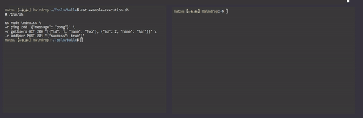

# Bulle

Bulle is a modern solution for mocking HTTP API's.

Bulle can be utilized to create mock API endpoints for development purposes or for general testing.

Bulle provides:

-   A quick to use Mock API supporting all HTTP methods
-   Customizable response codes and bodies
-   Input validation

### Usage

Bulle can be installed through npm with

```bash
npm install -g bulle
```

### Parameters

| Name    | Syntax            | Type           |  Description                                                                   |
| ------- | ----------------- | -------------- | ------------------------------------------------------------------------------ |
| Port    | `-p` or `--port`  | Number         | Specify the port in which you want to run Bulle. (Default port is 3000)        |
| Route   | `-r` or `--route` | A route object | Specify the route properties listed below                                      |
| Logfile | `-L` or `--logs`  | string         | Specify a log file. If you don't want to log anything, don't include this flag |

#### Forming a route

Creating a route for your mock API is simple. You can specify multiple parameters for each route, but these can also
be omitted, if you don't see the need to use them all.

Currently you can specify:

-   The endpoint of the route
-   The return code of the route
-   The return body of the route
-   Validations the route makes on input data

Each of these properties has a distinct format, and will be recognizer through regex, meaning that
the ordering of these parameters doesn't matter.

See the examples below

#### Examples

##### Generic single route example

```bash
bulle -r ping '{"message": "pong"}'
```

##### Multiple routes example

```bash
# Use the -p flag to set the port of the Mock API
bulle -p 3000 \
# Set up routes with the -r flag
-r ping 200 '{"message": "pong"}' \
# The order of parameters doesn't matter
-r '{"message": "pong"}' 200 pong \
# You can also specify a HTTP method for the route
-r users GET 200 '[{"id": 1, "name": "Foo"}, {"id": 2, "name": "Bar"}]' \
-r users/1 GET 200 '{"id": 1, "name": "Foo"}' \
-r users/add POST 201 '{"success": true}' \
# For larger return values, you can point towards a file containing the JSON data you want to return
-r users/add-tiger-king POST 201 example-return-body.json \
# If you want to validate the input, you can specify the types of inputs you are expecting.
# A 422 is returned on a invalid input
-r users/add-with-validations 201 POST '{"success": true}' 'id=number;name=string'
```

_For multiple route setups, a runnable script is recommended. A configuration file is in the works_

Bulle will start a [fastify](https://www.fastify.io/) HTTP server to serve the endpoints, and provide a CLI interface for monitoring requests.


